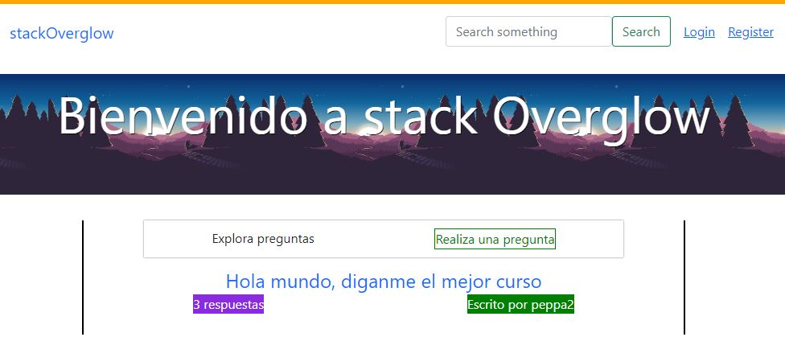
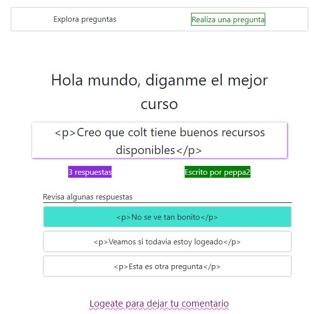
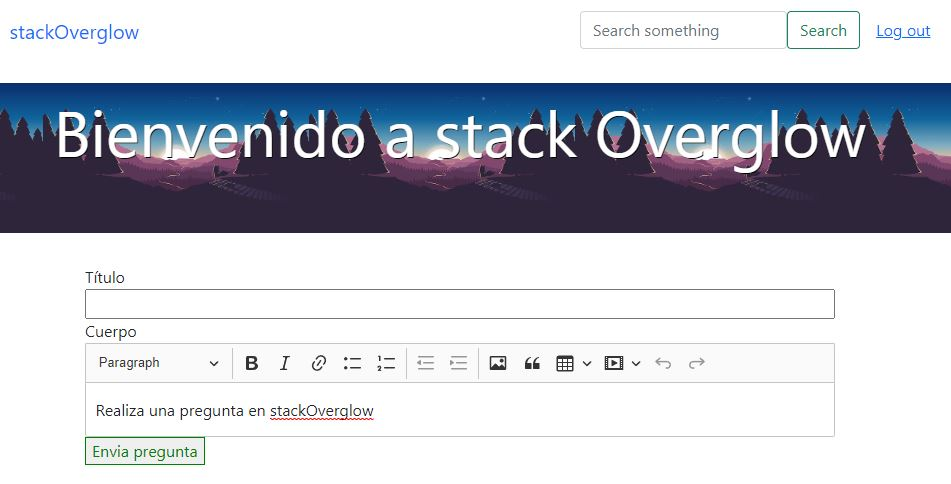

# StackOverglow UI

This is a small project which focus on some key features inspired on StackOverflow
platform. Hope to improve styling with MaterialUI components. It was build with
React (react-routerv6 as core for routing) and Parcel because the fast prototyping
(I've started with webpack but building is faster because abstraction).

## Table of contents

- [Overview](#overview)
  - [Screenshot](#screenshot)
  - [Links](#links)
- [Installing](#working)
  - [Built with](#built-with)
  - [Intallation](#installation)
  - [Future goal](#future-goals)
- [Author](#author)

## Overview
The main objective of the website is to show questions and add response 
features for logged users. In case of no logged users, they can search questions
and see responses in last updated order. The main search method would be by title but would like
to add tag structure for posts. When users logs, they can post questions and respond
questions. Finally, question user owner can choose a comment as correct and it will
appear at the top of the responses.

### Screenshot
Visiting the home page (not logged)


Visiting the question (not logged)


Leave a question (logged)


### Links

- Live Site URL: [Heroku page deployed](https://shielded-forest-07450.herokuapp.com/)

## Working

### Built with

- Semantic HTML5 markup
- CSS custom properties
- React JS
- Dependencies: parcel, react-router-dom, etc
- Future dependencies: Eslint, Prettier, MUI

### Intallation

To work with the project, you need to have Nodejs (because npm or yarn if like) and GitBash for cloning project. Next, we clone the project directly with the bash.
```bat
git clone https://github.com/marcos-rojas/stackOverglowClient.git
cd stackOverglowClient
npm install
```
Once all dependencies are installed, you can start to modify the components and add your prefered dependencies, even change it to webpack config and add some plugins to work with.
If you would like to see the UI, run the following command in the root directory. Note that you would need the REST API to get all the data you fetch (https://github.com/marcos-rojas/stackOverglow-api)
```bat
npm run dev
```
### Continued development

I would like to implement a more responsive option for devices whose screen is very
thin or new fold-way phones. I would prefer to try the design with ReactJS as well
as add interactivity and functionality for payment and routing for implementation
in a bigger project.

## Author

- Website - [Marcos Rojas](https://github.com/marcos-rojas)
